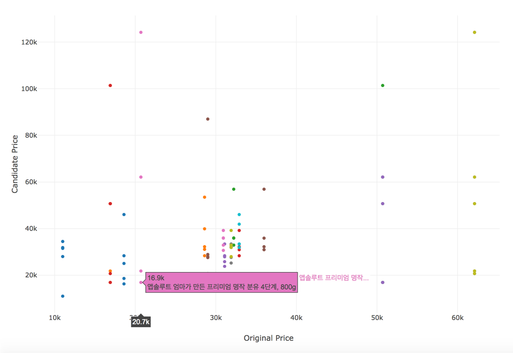

# mixedFeatureNN

This project contains how to find Nearest neighbour (unsupervised) by mixing Heterogeneous features
such as **Numerical Feature, Categorical Feature, Textual Feature**


## Data scheme

**rawData.csv** contains raw data crawled from a E-Commerce site in S.Korea
textual data is written in Korean

Data scheme is like below

**query,  id, query_item_rank,    price,  impressionCount,    clickCount, category,   brand,  title**

this data is treaten by hand-crafted, so it has some errors like wrong matched brand or category because of below
* impressionCount and clickCount is written as Random number
* brand is extracted by first token in title (because title token order is very well organized)
* title is tokenized by only 'space' and special characters, not used special tokenizer such as NLTK.
* category is extracted by using special keywords in my knowledge

this Data is indexed by query

## Description of this project

* This project shows simple Relevance feedback based Item recommendation.
* Relevance feedback:  https://en.wikipedia.org/wiki/Relevance_feedback
* This script response an higher ranked item A and items which are lower ranked and substitute for A  
  (potentially sellable = similar item)
* Candidates is classified based on K-NN (default K=5) by using categorical, numerical and textual features which are preprocessed by conducting such as impute and standarize numerical data, one hot vectorize in categorical data and CountVectorize in textual data.

## Dependencies
* Python 3.5+
* Numpy 1.16.1+
* pandas 0.24.1+
* Scikit-learn 0.20.2+
* scipy 1.2.1+
```
you can use requirements file as below
pip install -r requirements.txt
```

## Visualization Example
```./visualizer/output/test.hmtl```

above image shows the price of candidate items.
when you run ./visualizer/analysis.py, you can get a HTML to analyze price distribution.

## Description of functions

RawDataHandler.py

function
* genNumericMatrix:
convert raw data of numeric features to data frame format
* genCateMatrix:
convert raw data of categorical features to data frame format
* genTitleMatrix: query indexed document
convert raw data of title data( textual data ) to data frame format
* __featureMixer:
Mix all features by using Pipeline and ColumnTransformer in Scikit-learn
if you want to use some features, you can select index of those feature you want to select
this logic only use selected feature containing in "xxx_feat_idx"
```python
def __featureMixer(numFeatDim, cateFeatDim, txtFeatDim, num_feat_idx=None, 
                    cate_feat_idx=None, txt_feat_idx=None)
```
    * numFeatDim:
    * cateFeatDim:
    * txtFeatDim:
    * num_feat_idx:
    * cate_feat_idx:
    * txt_feat_idx:    
  
* mixingFeaturePipeline:

* recommend:
